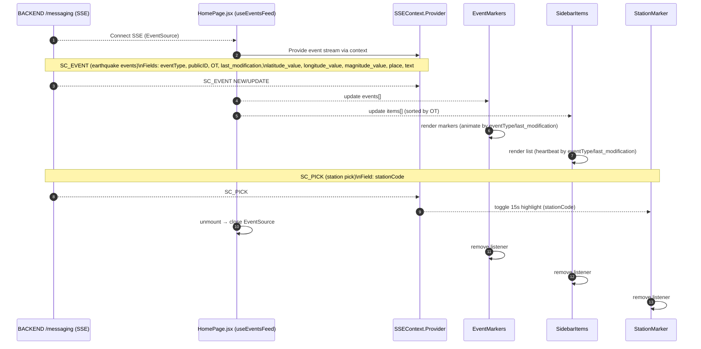

# Live Event Flow

```mermaid
sequenceDiagram
  autonumber
  participant Backend as BACKEND /messaging (SSE)
  participant HomePage as HomePage.jsx (useEventsFeed)
  participant SSE as SSEContext.Provider
  participant EventMarkers
  participant SidebarItems
  participant StationMarker

  Backend-->>HomePage: Connect SSE (EventSource)
  HomePage->>SSE: Provide event stream via context

  Note over Backend,SSE: SC_EVENT (earthquake events)\nFields: eventType, publicID, OT, last_modification,\nlatitude_value, longitude_value, magnitude_value, place, text
  Backend-->>SSE: SC_EVENT NEW/UPDATE
  HomePage-->>EventMarkers: update events[]
  HomePage-->>SidebarItems: update items[] (sorted by OT)
  EventMarkers->>EventMarkers: render markers (animate by eventType/last_modification)
  SidebarItems->>SidebarItems: render list (heartbeat by eventType/last_modification)

  Note over Backend,StationMarker: SC_PICK (station pick)\nField: stationCode
  Backend-->>SSE: SC_PICK
  SSE-->>StationMarker: toggle 15s highlight (stationCode)

  HomePage->>HomePage: unmount → close EventSource
  EventMarkers->>EventMarkers: remove listener
  SidebarItems->>SidebarItems: remove listener
  StationMarker->>StationMarker: remove listener
```
