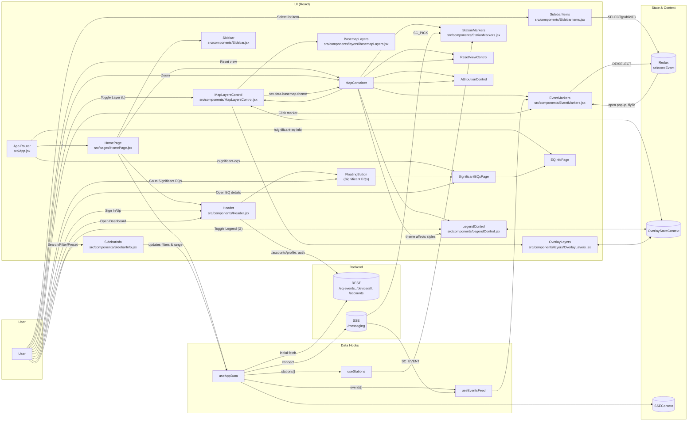

# Component Interaction Overview

```mermaid
flowchart LR
  %% Clusters
  subgraph USER[User]
    U[User]
  end

  subgraph UI["UI (React)"]
    App[App Router\nsrc/App.jsx]
    Home[HomePage\nsrc/pages/HomePage.jsx]
    Header[Header\nsrc/components/Header.jsx]
    Sidebar[Sidebar\nsrc/components/Sidebar.jsx]
    SInfo[SidebarInfo\nsrc/components/SidebarInfo.jsx]
    SItems[SidebarItems\nsrc/components/SidebarItems.jsx]
    Map[MapContainer]
    MLC[MapLayersControl\nsrc/components/MapLayersControl.jsx]
    Base[BasemapLayers\nsrc/components/layers/BasemapLayers.jsx]
    Over[OverlayLayers\nsrc/components/layers/OverlayLayers.jsx]
    Legend[LegendControl\nsrc/components/LegendControl.jsx]
    EMarks[EventMarkers\nsrc/components/EventMarkers.jsx]
    SMarks[StationMarkers\nsrc/components/StationMarkers.jsx]
    Reset[ResetViewControl]
    Attr[AttributionControl]
    FAB["FloatingButton\n(Significant EQs)"]
    SEQs[SignificantEQsPage]
    EQInfo[EQInfoPage]
  end

  subgraph STATE[State & Context]
    Redux[(Redux\nselectedEvent)]
    OState[(OverlayStateContext)]
    SSEctx[(SSEContext)]
  end

  subgraph DATA[Data Hooks]
    UAD[useAppData]
    UEF[useEventsFeed]
    UST[useStations]
  end

  subgraph BE[Backend]
    API[(REST\n/eq-events, /device/all, /accounts)]
    SSE[(SSE\n/messaging)]
  end

  %% Routing & Composition
  App -->|"/"| Home
  App -->|"/significant-eqs"| SEQs
  App -->|"/significant-eq-info"| EQInfo
  Home --> Header
  Home --> Sidebar
  Home --> Map
  Map --> MLC
  Map --> Legend
  Map --> EMarks
  Map --> SMarks
  Map --> Reset
  Map --> Attr
  MLC --> Base
  MLC --> Over
  Header --> FAB

  %% State wiring
  MLC <--> OState
  Legend <--> OState
  Over <--> OState
  SItems -->|"SELECT(publicID)"| Redux
  EMarks -->|DE/SELECT| Redux
  Redux -->|open popup, flyTo| EMarks

  %% Data flow
  Home --> UAD
  UAD -->|initial fetch| API
  UAD -->|connect| SSE
  UAD --> SSEctx
  UAD -->|"stations[]"| UST
  UAD -->|"events[]"| UEF
  UST --> SMarks
  UEF --> EMarks
  SSE -->|SC_EVENT| UEF
  SSE -->|SC_PICK| SMarks

  %% User actions (selected)
  U -->|"Toggle Layer (L)"| MLC
  U -->|"Toggle Legend (G)"| Legend
  U -->|Search/Filter/Preset| SInfo
  SInfo -->|updates filters & range| UAD
  U -->|Select list item| SItems
  U -->|Click marker| EMarks
  U -->|Reset view| Reset
  U -->|Zoom| Map
  U -->|Sign In/Up| Header
  Header -->|/accounts/profile, auth| API
  U -->|Open Dashboard| Header
  U -->|Go to Significant EQs| FAB --> SEQs
  U -->|Open EQ details| SEQs --> EQInfo

  %% Theming & attribution
  MLC -->|set data-basemap-theme| Map
  Map -->|theme affects styles| Legend
  Map --> Attr
```
