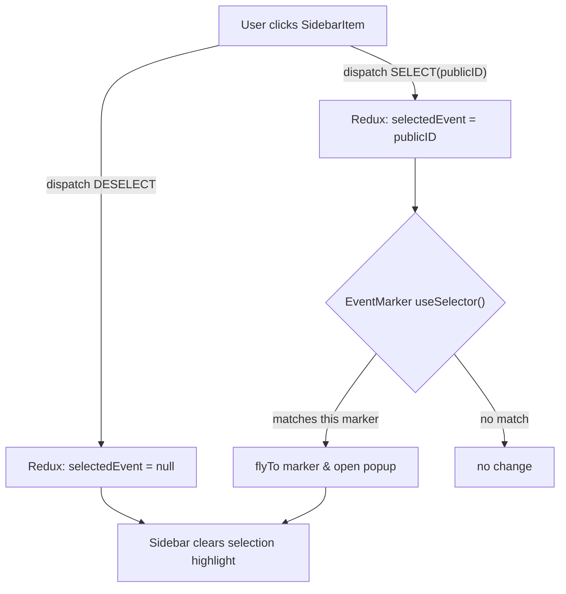

# Selection State Flow

```mermaid
flowchart TD
  A["User clicks SidebarItem"] -->|"dispatch SELECT(publicID)"| B["Redux: selectedEvent = publicID"]
  A -->|"dispatch DESELECT"| C["Redux: selectedEvent = null"]
  B --> D{"EventMarker useSelector()"}
  D -->|"matches this marker"| E["flyTo marker & open popup"]
  D -->|"no match"| F["no change"]
  C --> H["Sidebar clears selection highlight"]
  E --> H
```
